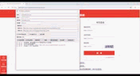

# 公务员网站自动登录助手
(国考抢考场的小工具，就是给不会下油猴的哥们用的，大佬勿喷)
本项目是基于 Tkinter 图形界面、DrissionPage 浏览器自动化与 ddddocr 验证码识别的登录辅助工具。支持“报名( bm ) / 考务( kw )”两种模式、循环登录、停止循环、一键刷新、灵活的元素选择器、验证码测试、浏览器选择等功能。

## 功能与操作演示
- 报名/考务模式切换（不同页面布局，登录逻辑自适应）
- 账号、密码、序列号（考务）填写
- **GUI中直接编辑登录URL**（报名和考务URL可在界面中修改，适配每年不同的登录地址）
- **浏览器选择**（支持 Chrome、Edge、Firefox）
- **循环次数GUI设置**（可在界面中直接设置循环登录次数）
- 自动识别验证码（ddddocr，支持混合数字+字母）
- 循环登录与中断按钮
- 一键打开页面 / 刷新页面 / 单次登录
- 测试验证码识别（打印图片地址/截图大小与 OCR 结果）
- 配置拆分：用户数据 `user_data.json` 与应用配置 `app_config.json`
- 灵活选择器：每个元素可单独配置 `selector` 与 `selector_type`
- 懒加载浏览器与 OCR，提升 GUI 启动速度
- 浏览器操作后台线程执行，避免 GUI 卡顿
- 可选“窗口置顶”
- 平均每1min登录约25-30次

下载链接：https://github.com/666cy666/ServantLoginScript/releases/download/ServantLoginScriptV1.0/ServantLoginScriptV1.0.zip

操作流程：

- 检查**公务员报名确认及准考证打印系统**网址是否为当年最新网址（该网址为2026年国考网址）
- 填写相关信息，如身份证账号、序列号等
- 测试浏览器是否能正常启动

检查完后如若未到系统开放时间可先到**国考报名登陆页**测试相关功能(登录页验证码很难识别)，**公务员报名确认及准考证打印系统**开放后，可直接点击循环测试开启抢考点模式。

根据作者经验猜测，该系统有个排队的优先队列，排到你的时候你点击登录会跳转到上传照片选考点的界面，如果排到你时没有进入你没有进入页面，那么该名额就会被其他人占用，你就得重新排，所以需要不断测试是否能登进，而该软件就是解放双手自动登录，在旁边刷手机看看日志运行情况就得（大概猜测是这样）

当页面出现卡顿或者白屏的时候，多半是你已经通过排队队列，进入系统，但是由于人还是很多，所以资源加载还是很慢，作者报名时进过很多次，之前都很卡，进不去，这个时候需要点击中断循环，不断刷新界面，因为这个时候你已经进去系统了，但是加载不出来，如果刷一分钟还是出不来就重新启动循环排队，也不费力，反正自动化。


## 目录结构
```
ServantLoginScript/
├─ main.py                    # 程序入口，Tkinter GUI 与业务逻辑
├─ util/
│  ├─ config_store.py         # 配置与用户数据的读取/保存、选择器解析
│  ├─ drission_helper.py      # DrissionPage 封装（输入、点击、截图、属性获取）
│  └─ ocr_helper.py           # ddddocr 封装
├─ config/
│  ├─ app_config.json         # 应用配置（URL、选择器、循环次数）
│  └─ user_data.json          # 用户数据（账号、密码、置顶、无头、默认模式、序列号、浏览器类型、GUI循环次数）
├─ README.md                  # 文档（本文件）
├─ requirements.txt           # 依赖清单
```

## 安装与运行
1. 安装 Python 3.10+ (Windows 推荐) 与 pip。
2. 安装依赖：
   ```bash
   pip install -r requirements.txt
   ```
3. 配置 `config/app_config.json` 中的登录 URL 与选择器（详见下文“配置说明”）。
4. 运行：
   ```bash
   python main.py
   ```

> 首次运行会自动生成 `config/user_data.json` 与 `config/app_config.json`（如不存在），并打印路径日志。

## 配置说明
- 用户数据：`config/user_data.json`
  - `account`, `password`: 账号/密码
  - `auto_ocr`: 是否自动识别验证码
  - `headless`: 是否无头模式运行浏览器
  - `topmost`: 窗口是否置顶
  - `mode`: 默认模式（`bm` 或 `kw`）
  - `kw_serial`: 考务登录时的序列号
  - `browser`: 浏览器类型（`chrome`、`edge`、`firefox`）
  - `loop_attemptsGUI`: GUI中设置的循环次数

- 应用配置：`config/app_config.json`
  - `login.bm` 与 `login.kw`：分别对应报名/考务页面
    - `url`: 登录页面URL（可在GUI中直接编辑）
  - `selector_type`: 默认选择器类型（当某个元素仅写字符串选择器时使用）
  - 每个元素支持两种写法：
    1) 字符串（使用默认 `selector_type`）
    2) 对象：`{"selector": "...", "selector_type": "css|xpath|id|class_name|name|tag"}`
  - `loop_attempts`: 默认循环尝试次数（GUI中的设置会优先使用）

示例（节选）：
```json
{
  "login": {
    "bm": {
      "url": "http://bm.scs.gov.cn/pp/gkweb/core/web/ui/business/auth/login.html",
      "selector_type": "class_name",
      "username": { "selector": "input240", "selector_type": "class_name" },
      "password": { "selector": "input240 password", "selector_type": "class_name" },
      "captcha_image": { "selector": "captchaImg", "selector_type": "id" },
      "captcha_input": { "selector": "captchaWord", "selector_type": "id" },
      "submit": { "selector": "register_btn", "selector_type": "class_name" }
    },
    "kw": {
      "url": "",
      "selector_type": "css",
      "username": { "selector": "", "selector_type": "css" },
      "password": { "selector": "", "selector_type": "css" },
      "serial":   { "selector": "", "selector_type": "css" },
      "captcha_image": { "selector": "", "selector_type": "id" },
      "captcha_input": { "selector": "", "selector_type": "id" },
      "submit": { "selector": "", "selector_type": "css" }
    }
  },
  "loop_attempts": 3
}
```

## 使用说明
- 顶部依次输入：账号、密码、序列号（考务使用）
- 选择浏览器：Chrome、Edge 或 Firefox
- 登录网址：可直接在GUI中编辑报名和考务的登录URL（每年登录地址可能不同）
- 勾选：自动识别验证码 / 后台登录(无头) / 窗口置顶
- 循环次数：可在GUI中直接设置循环登录次数
- 按钮栏（两行布局，每行4个）：
  - **第一行**：打开报名界面 / 打开考务界面 / 刷新界面 / 登录
  - **第二行**：循环测试登录 / 停止循环 / 测试验证码 / 关于

> 所有浏览器操作均在后台线程执行，防止 GUI 卡顿。日志区域实时显示操作状态。

## 选择器类型支持
- `css`, `xpath`, `class_name`, `id`, `name`, `tag`

## 常见问题（FAQ）
- 启动慢？
  - 浏览器与 OCR 均已懒加载，仅在需要时初始化。
- GUI 卡顿？
  - 浏览器操作全部放在后台线程；日志更新通过 `after()` 保障线程安全。
- 验证码识别错误？
  - 使用“测试验证码”按钮查看图片地址/截图与识别结果，并适当调整页面选择器或多试几次。

## 依赖
- Python 3.10+
- DrissionPage
- ddddocr
- requests

## 许可证
仅供学习与交流，请勿用于任何违反网站条款的用途。
